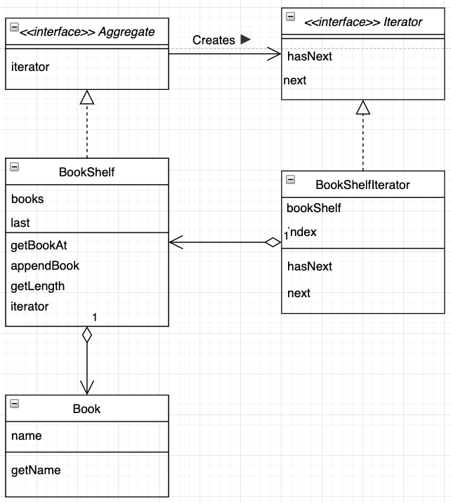

# Iterator

- Iterator(반복자) 클래스
  - iterate: 반복하다
  - 순서대로 순회하기 위해 사용
- Aggregate(집합체)
  - aggregate: 모으다, 모이다, 집합
  - iterator 메소드를 사용해 Iterator 인스턴스를 만듬
    - Factory <u>Creates ►</u> Product
    - (iterator 메소드는 Iterator 인스턴스를 만드는 Factory Method)

## Example

