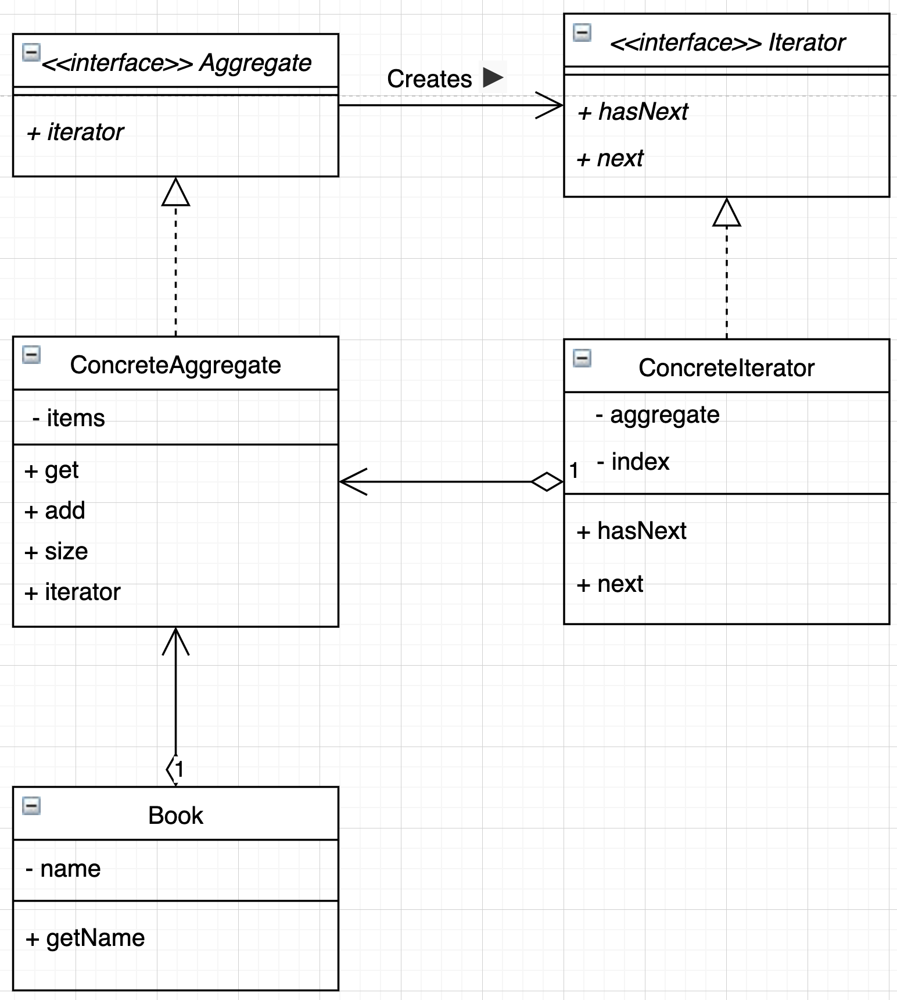

# ghojeong.Iterator

## ConcreteIterator 의 aggregate 멤버

자신이 순회할 aggregate 를 생성자에게 할당받아서,  
next 를 통해 자신이 가진 aggregate를 순회한다.

## ConcreteAggregate 의 iterator 멤버

자기 자신(this)을 aggregate 멤버로 가지는 iterator를 생성해서,
Main 함수가 해당 iterator로 자기 자신을 순회할 수 있도록 한다.

