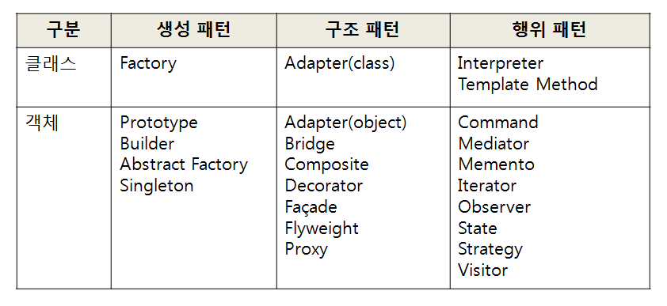

# Summary

## UML 기초

- UML(Unified Modeling Language)

### [Class Diagram](https://minwan1.github.io/2018/02/04/2018-02-04-Class-Diagram) 기초

클래스, 인스턴스, 인터페이스 등의 정적 관계

#### 용어 비교

|    UML    |  Java  |      C,C++      |
| :-------: | :----: | :-------------: |
| attribute | field  | member variable |
| operation | method | member function |

#### 선 비교

- 화살표 방향: 갈구는 쪽 -> 갈굼받는 쪽

|      |     실선(-▷)      | 점선(--▷)  |        ◇-▷        |
| :--- | :---------------: | :--------: | :---------------: |
| 관계 | 상속(inheritance) | interface  | 집약(aggregation) |
| 문법 |      extends      | implements | function function |

#### 기호별 의미

|                        |     Class      |      Field      |      Method      |
| :--------------------- | :------------: | :-------------: | :--------------: |
| _이탤릭(italic)_       | abstract class |                 | abstract method  |
| <u>밑줄(underline)</u> |                |  static field   |  static method   |
| `+`                    |                |  public field   |  public method   |
| `-`                    |                |  private field  |  private method  |
| `#`                    |                | protected field | protected method |
| `~`                    |                |      field      |      method      |

#### 클래스 관계

- Client <u>Uses ►</u> Target
  - 예시) Singleton 패턴
- Factory <u>Creates ►</u> Product
  - 예시) Factory 패턴
- Subject <u>Notifies ►</u> Observer
  - 예시) Observer 패턴

### Sequence Diagram 기초

실행 순서를 도식화

- 인스턴스 표기법: **instance:Class**
- Life Line(생존선)
  - 위쪽은 과거, 아래쪽은 미래
  - 직사각형(객체가 활동 중인 기간)
  - -► (실선): 메소드 호출(call method)
  - <-- (점선): 메소드의 반환(return of method)

## 목차 정리

- 기초
  - Iterator: 순서대로 지정
  - Adapter: 바꿔서 재이용
- 하위 클래스에게 위임(상속)
  - Template Method: 하위 클래스에서 처리
  - Factory Method: 하위 클래스에서 인스턴스 작성
- 인스턴스 만들기
  - Singleton: 인스턴스 1개만 생성
  - Prototype: 복사해서 인스턴스 생성
  - Builder: 복잡한 인스턴스 조립
  - Abstract Factory: 부품 조합
- 분리해서 생각하기
  - Bridge: 기능 계층과 구현 계층 분리
  - Strategy: 알고리즘 모두 바꾸기
- 동일시 하기
  - Composite: 그릇과 내용물 동일시
  - Decorator: 장식과 내용물 동일시
- 데이터 구조 돌아다니기
  - Visitor: 데이터 구조를 돌아다니며 동일한 조작을 반복
  - Chain of Responsibility: 책임 떠넘기기
- 단순화하기
  - Facade: 창구 역할을 하는 클래스 배치
  - Mediator: 중개인 클래스를 통해 처리
- 상태 관리하기
  - Observer: 상태의 변화 알려주기
  - Memento: 상태를 저장
  - State: 상태를 클래스로 표현
- 낭비 없애기
  - Flyweight: 동일한 것은 공유해서 낭비 없애기
  - Proxy: 필요해지면 만들기
- 클래스로 표현하기
  - Command: 명령을 클래스로 표현
  - Interpreter: 문법규칙을 클래스로 표현
