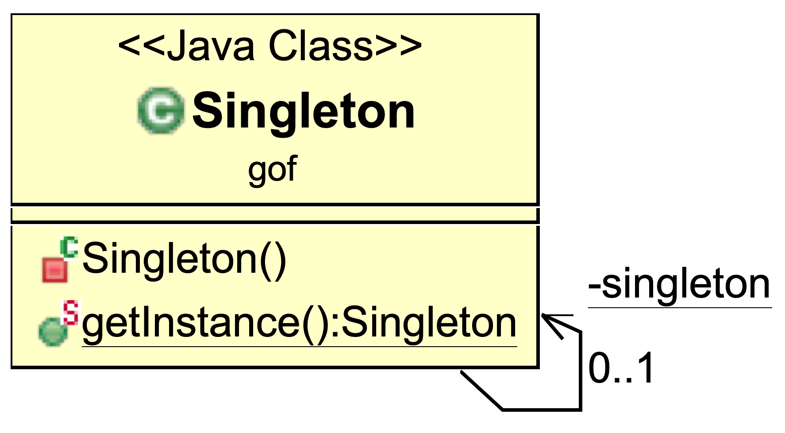
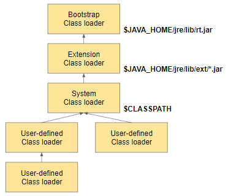
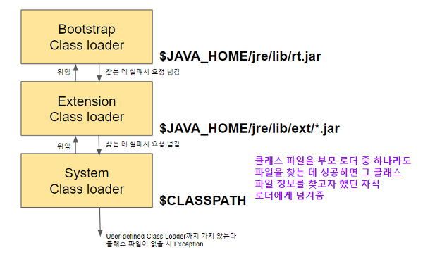

# Singleton

- singleton의 뜻: 요소를 1개밖에 가지고 있지 않은 집합
- Singleton 디자인 패턴: 클래스의 인스턴스가 단 한 개만 존재

## 만드는 방법

- 생성자를 private 으로 선언한다.
- 클래스의 인스턴스를 private static 으로 선언한다.
- getInstance 함수로만 인스턴스에 접근한다.



```java
public class Singleton {
    private static Singleton singleton = new Singleton();
    private Singleton() {
        // 초기화
    }
    public static Singleton getInstance() {
        return singleton;
    }
}
```

```java
public class Main {
    public static void main(String[] args) {
        // obj1과 obj2는 같은 인스턴스
        Singleton obj1 = Singleton.getInstance();
        Singleton obj2 = Singleton.getInstance();
    }
}
```

## Static Class 와의 차이점

```java
public class Singleton {
    private String username;
    private static Singleton singleton = new Singleton();
    private Singleton() {
        this.username = "고정완";
    }
    public String getConfig() {
      return "username은 " + username;
    }
    public static Singleton getInstance() {
        return singleton;
    }
}
```

```java
public class Main {
    public static class StaticClass {
        private static String username = "고정완";
        public static String getConfig() {
          return "username은 " + username;
        }
    }
    public static void main(String[] args) {
        Singleton singleton = Singleton.getInstance();
        System.out.println(singleton.getConfig());
        System.out.println(StaticClass.getConfig());
    }
}
```

| Singleton                                     | Static Class                                             |
| --------------------------------------------- | -------------------------------------------------------- |
| Heap 메모리에 인스턴스가 생성됨               | Stack 메모리의 레퍼런스로 클래스에 접근                  |
| 런타임에 인스턴스 생성                        | 컴파일 타임에 클래스 정의(따라서 앱 실행시 조금 더 빠름) |
| Object의 함수 사용 가능                       | Object의 함수 사용 불가능(Object.clone)                  |
| 다형성 가능 (getConfig 함수를 overwrite 가능) | 다형성 불가능                                            |
| 상속과 인터페이스 구현 가능                   | extends, implements 불가능                               |


## 접근(access) 및 생명주기(life cycle)

- Java Application
  - Class Loader 로 접근
  - 객체 인스턴스의 생명주기에 따름
- Spring
  - ApplicationContext 로 접근
  - ApplicationContext 의 생명주기에 따름

### Class Loader

| 클래스 로더의 동작 순서                 | 동작 방식                                                 |
| --------------------------------------- | --------------------------------------------------------- |
|  |  |

- 이 과정을 통해 class 를 찾는데 실패하면 `java.lang.ClassNotFoundException` 이 뜸

## 연습 문제

### 5-1 문제

다음 TicketMaker 클래스는 getNextTicketNumber 메소드를 호출할 때마다 1000, 1001, 1002, ... 라는 Ticket의 일련 번호를 생성하여 순서대로 반환합니다. Singleton 패턴을 적용해서 TicketMaker의 인스턴스가 하나만 만들어지도록 하십시오.

```java
public class TicketMaker {
    private int ticket = 1000;
    public int getNextTicketNumber() {
        return ticket++;
    }
}
```

### 5-1 풀이

```java
public class TicketMaker {
    private int ticket = 1000;
    private static TicketMaker singleton = new TicketMaker();
    private TicketMaker() {
    }
    public static TicketMaker getInstance() {
        return singleton;
    }
    public synchronized int getNextTicketNumber() {
        return ticket++;
    }
}
```

### 5-2 문제

인스턴스의 개수가 3개로 한정되어 있는 클래스 Triple을 만드십시오. 인스턴스에는 0, 1, 2 라는 번호가 붙어있고 getInstance(int id)에서 id번의 인스턴스가 얻어진다고 가정합니다.

### 5-2 풀이

```java
public class Triple {
    private static Triple[] triple = new Triple[]{
        new Triple(0),
        new Triple(1),
        new Triple(2),
    };
    private int id;
    private Triple(int id) {
        System.out.println("The instance " + id + " is created.");
        this.id = id;
    }
    public static Triple getInstance(int id) {
        return triple[id];
    }
    public String toString() {
        return "[Triple id=" + id + "]";
    }
}
```

### 5-3 문제

아래 Singleton 클래스가 싱글톤 패턴이 아닌 이유를 말하시오.

```java
public class Singleton {
    private static Singleton singleton = null;
    private Singleton() {
        System.out.println("Create Instance");
    }
    public static Singleton getInstance() {
        if (singleton == null) {
            singleton = new Singleton();
        }
        return singleton;
    }
}
```

### 5-3 풀이

멀티쓰레드 환경에서 여러개의 instance가 만들어질 수 있음. singleton 레퍼런스를 사용할 때, synchronized 를 해야함

```java
public class Singleton {
    private static Singleton singleton = null;
    private Singleton() {
        System.out.println("Create Instance");
    }
    public static synchronized Singleton getInstance() {
        if (singleton == null) {
            singleton = new Singleton();
        }
        return singleton;
    }
}
```
